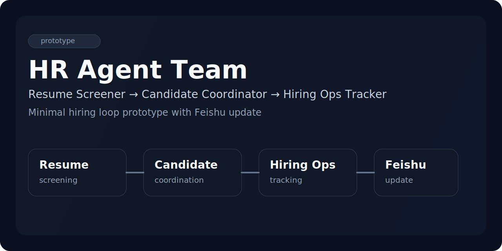
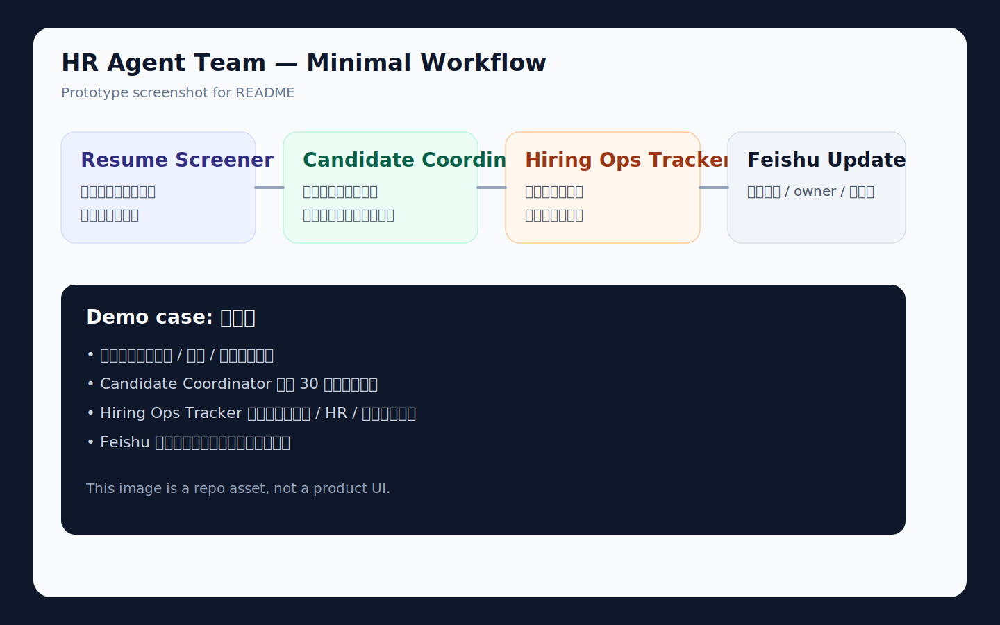

# hiring-loop



A minimal OpenClaw skill prototype for a small hiring workflow.

This repo now captures that loop in an OpenClaw skill-friendly structure:

- Resume Screener
- Candidate Coordinator
- Hiring Ops Tracker
- Feishu table update

It is **not** a full ATS, HRMS, or recruiting platform.
It is a lightweight prototype for a real, already-tested hiring loop.

## What is already working

### 1) Resume Screener
Handles first-pass screening for incoming resumes.

### 2) Candidate Coordinator
Handles only 3 actions:
- request-more-info message
- interview scheduling message
- candidate reply summary

### 3) Hiring Ops Tracker
Handles only 4 actions:
- current stage
- current owner
- next step
- blocked / timeout status

## Current workflow

Resume in  
→ Resume Screener  
→ Candidate Coordinator  
→ Hiring Ops Tracker  
→ Feishu update

## Fixed rules in this prototype

### Stage fields
- 待补资料
- 待约初面
- 待面试反馈
- 待继续推进
- 待归档
- 已暂停
- 已转岗

### Status fields
- 正常推进
- 临近超时
- 已卡住

### Time rules
- within 24 hours → 正常推进
- 24–48 hours → 临近超时
- over 48 hours → 已卡住

## Repo structure

```text
SKILL.md
references/
assets/
docs/
examples/
agents/
```

## Included in this repo

- SKILL.md for OpenClaw skill loading
- reference docs for 3 sub-capabilities
- final prompts and minimal templates
- fixed workflow and rules
- Feishu field notes
- demo cases
- repo about text for GitHub setup
- quickstart and use-case notes
- simple cover and screenshot assets

## Not included

- full ATS
- permission system
- dashboard
- complex workflow engine
- independent bots
- company-internal structure

## Why this repo exists

This repo is a clean public prototype backup before moving the work into the company Git team.
It keeps the current minimum loop in one place: prompts, templates, rules, examples, and workflow notes.

## Preview asset


